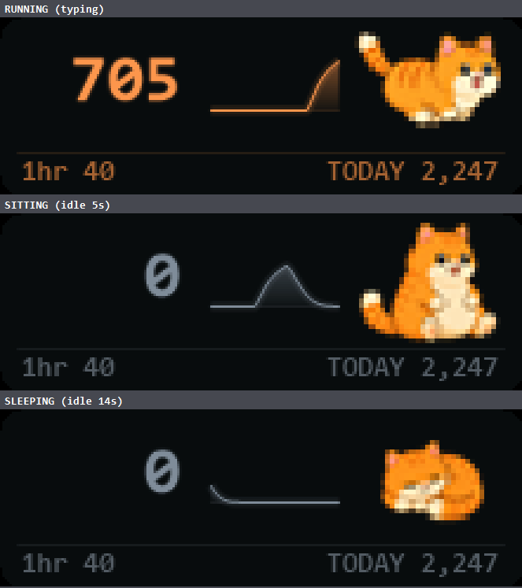

# KeyboardCounter

A tiny always-on-top Windows widget that shows how fast you are typing, right now.
Like an old taxi meter: **the cat runs while you type, sits when you stop, and falls asleep if you rest.**



**[English](#english) · [한국어](#한국어)**

---

## English

- No installer. **Grab the exe and double-click it.**
- 208×71 pixels, borderless and translucent, so it can sit in a corner without getting in the way
- Under **0.03% CPU**, 23 MB of memory
- **Never blocks or delays your keystrokes** (see below)

### Getting started

1. **[Download `KeyboardCounter.exe`](https://github.com/SeungOhh/key-counter/raw/main/KeyboardCounter.exe)**
   (or click `KeyboardCounter.exe` in the file list above, then the download button)
2. Put it in any folder you like
3. Double-click it
4. Drag the widget wherever you want it

That's the whole setup — no installer, no .NET to install, no administrator rights.

**On first run, Windows SmartScreen will probably warn you.** The exe is unsigned, and a signing
certificate costs money. Click **More info → Run anyway**. If you would rather not take that on
faith, [build it yourself](#building) from the source in this repo — it takes one command and
needs no build tools.

To move or back it up, take the whole folder: settings and today's count live in
`KeyboardCounter.ini` next to the exe. To uninstall, delete the folder — nothing is written
anywhere else, and nothing is added to the registry unless you turn on "Run at Windows startup".

### Is this a keylogger?

Fair question. Counting keystrokes requires a global keyboard hook, which is the same API a keylogger
uses. So here is exactly what it does and does not do.

**What it does**

- Counts the **fact** that a key was pressed
- Looks at *which* key **only** to decide whether it counts (Shift, Ctrl, IME toggles are excluded)

**What it does not do**

- **Never records which keys you pressed** — not to disk, not to the screen
- **Never uses the network** — there is no networking code in the source at all
- Writes exactly one file, `KeyboardCounter.ini`: window position, settings, and today's total

**It does not swallow or delay input.** The hook unconditionally forwards every key it receives.
This was measured, not assumed: with a control hook placed behind the widget in the chain, 300 of 300
injected keystrokes came through.

The entire source is one readable file → [`KeyboardCounter.cs`](KeyboardCounter.cs)

### Reading the display

```
   757   ╱▔╲╱▔    🐈
 1hr 1,108   TODAY 8,240
```

| Element | Meaning |
|---|---|
| **Big number** | Current typing speed in keys per minute. Keyboard only — mouse clicks are not counted |
| **Graph** | The last 12 seconds. The vertical scale adjusts itself |
| **1hr** | Keystrokes in the last 60 minutes (only while the widget was running) |
| **TODAY** | Today's total. Resets automatically at midnight |
| **Cat** | Runs while you type, sits when you stop, sleeps after 10 seconds of rest |

The number and graph **change colour with speed**: grey → sky → green → yellow → orange → red.

Modifiers (Shift/Ctrl/Alt/Win), lock keys, and IME switch keys are excluded.
Auto-repeat from holding a key down counts only once.

### Controls

| To do this | Do that |
|---|---|
| Move it | Drag with the left mouse button |
| Open settings | **Right-click** the widget |
| Quit | Right-click → Exit |

The right-click menu offers **Size** (Small / Normal / Large / Extra large),
**Response** speed (0.7s / 1.2s / 2.5s), **Always on top**, **Run at Windows startup**,
**Reset today's count**, and **Reset position**.

### Performance

It is meant to run all day, so the cost was measured rather than guessed.

| | |
|---|---|
| CPU, idle | **0.000 %** |
| CPU, typing at 8 keys/sec | **0.023 %** |
| CPU, typing at 15 keys/sec | **0.008 %** |
| Memory (private) | **~23 MB** at launch, settles near 28 MB |
| Memory (working set, what Task Manager shows) | 34–40 MB |
| Work per keystroke | **26 ns**, with zero heap allocation |
| Added input latency | **~0.1 ms** per keystroke |

CPU percentages are on a 20-core machine, using the convention Task Manager displays.
A 4-minute idle watch showed memory flatten and then give a little back, with GDI handles
and handle count steady — no leak.

Almost all of that memory is the .NET WinForms runtime itself; the widget's own data
(history buffer, hour buckets, sprite sheet) is under 100 KB combined.

The 0.1 ms latency is not the widget's arithmetic — it is the cost of a low-level keyboard hook
sitting in the input path at all. For scale, one frame at 60 Hz is 16.7 ms.
[NOTES.md](NOTES.md) covers how each of these was measured and why Raw Input would avoid that
last cost entirely.

### Worth knowing

Remote Desktop depends on which direction you are going:

| Situation | Counted? |
|---|---|
| Someone connects **into this PC** and types | **Yes** |
| You connect **out to another PC** and type there | No — the keys go to that machine |

The widget counts **keys that arrive at this PC**, not "keys you pressed".
To cover both machines, copy the exe to the other one and run it there too.

**1hr and TODAY only accumulate while the widget is running.** Time it was closed cannot be counted.

### Building

```powershell
git clone https://github.com/SeungOhh/key-counter.git
cd key-counter
powershell -ExecutionPolicy Bypass -File build.ps1
```

No .NET SDK, no Visual Studio, no Python — nothing to install. It compiles with the C# compiler
Windows already ships (`C:\Windows\Microsoft.NET\Framework64\v4.0.30319\csc.exe`) into a single
~63 KB `KeyboardCounter.exe` that runs as-is on any other Windows PC.

(No git? Use **Code → Download ZIP** at the top of this page, unzip, and run the same command.)

To change the cat, replace the images in `src/` and run `tools\make_sprite.ps1`, then paste its
output over the sprite block in `KeyboardCounter.cs`.

### Files

| File | What it is |
|---|---|
| `KeyboardCounter.cs` | The entire source, one file |
| `build.ps1` | Build script |
| `src/` | Original cat artwork (embedded into the exe as a sprite sheet) |
| `tools/make_sprite.ps1` | Regenerates the embedded sprite from `src/` |
| `KeyboardCounter.ini` | Settings and today's total. Delete it to return to defaults |

Implementation notes — the rate formula, the hook that dies silently, sprite handling, and
measured performance — are in [NOTES.md](NOTES.md).

### License

[MIT](LICENSE). The cat artwork in `src/` is original, so it carries the same terms as the code.

---

## 한국어

지금 몇 타로 치고 있는지 항상 화면 위에 띄워주는 아주 작은 윈도우 위젯.
옛날 택시 미터기 느낌으로, **치면 고양이가 달리고 멈추면 앉았다가 잠듭니다.**

- 설치 필요 없음. **exe 하나 받아서 더블클릭**하면 끝
- 208×71 픽셀. 테두리 없이 반투명해서 구석에 놔둬도 안 거슬림
- CPU **0.03% 미만**, 메모리 23MB
- 키 입력을 **가로채거나 늦추지 않음** (아래 참고)

### 시작하기

1. **[`KeyboardCounter.exe` 받기](https://github.com/SeungOhh/key-counter/raw/main/KeyboardCounter.exe)**
   (또는 위 파일 목록에서 `KeyboardCounter.exe` 를 눌러 다운로드 버튼)
2. 아무 폴더에나 둡니다
3. 더블클릭합니다
4. 위젯을 원하는 자리로 끌어다 놓습니다

끝입니다. 설치 프로그램도, .NET 설치도, 관리자 권한도 필요 없습니다.

**처음 실행하면 SmartScreen이 경고할 가능성이 높습니다.** 서명되지 않은 exe라 그렇습니다
(서명 인증서는 유료입니다). **추가 정보 → 실행**을 누르시면 됩니다. 그냥 믿기 찜찜하면
저장소의 소스로 [직접 빌드](#빌드)하세요 — 명령 한 줄이고 빌드 도구도 필요 없습니다.

옮기거나 백업할 땐 폴더째 가져가세요. 설정과 오늘 타수가 exe 옆 `KeyboardCounter.ini` 에 있습니다.
지우려면 폴더를 삭제하면 끝입니다 — 다른 곳에 쓰는 파일이 없고, "Run at Windows startup" 을
켜지 않는 한 레지스트리도 건드리지 않습니다.

### 이거 키로거 아닌가요?

정당한 의심입니다. 타수를 세려면 전역 키보드 후크를 쓸 수밖에 없고, 그건 키로거가 쓰는 것과 같은
API입니다. 그래서 무엇을 하고 무엇을 안 하는지 분명히 적습니다.

**하는 일**

- 키가 눌렸다는 **사실만** 셉니다
- 어떤 키인지는 **세는 대상인지 판별하려고만** 봅니다 (Shift·Ctrl·한/영 등은 제외하려고)

**하지 않는 일**

- 어떤 키를 눌렀는지 **기록하지 않습니다** — 파일에도, 화면에도 남기지 않습니다
- **네트워크를 쓰지 않습니다** — 소스에 통신 코드가 아예 없습니다
- 파일은 딱 하나, `KeyboardCounter.ini` 만 씁니다. 창 위치·설정·오늘 누적값이 전부입니다

**키 입력을 막거나 늦추지 않습니다.** 후크는 받은 키를 무조건 다음으로 넘깁니다.
추측이 아니라 실측입니다 — 위젯 뒤쪽 체인에 대조용 후크를 두고 300개를 주입해 300개 전부 통과를 확인했습니다.

전체 소스는 파일 하나뿐이라 한 번에 읽을 수 있습니다 → [`KeyboardCounter.cs`](KeyboardCounter.cs)

### 화면 보는 법

| 표시 | 뜻 |
|---|---|
| **큰 숫자** | 지금 타수(분당). 키보드만 세고 마우스 클릭은 안 셉니다 |
| **그래프** | 최근 12초 추이. 세로 눈금은 알아서 맞춰집니다 |
| **1hr** | 최근 60분 동안 누른 횟수 (위젯이 켜져 있던 동안만) |
| **TODAY** | 오늘 누적. 자정이 지나면 자동으로 0부터 다시 셉니다 |
| **고양이** | 치는 중엔 달리고, 멈추면 앉고, 10초 넘게 쉬면 잠듭니다 |

숫자와 그래프 **색은 타수에 따라** 회색 → 하늘 → 초록 → 노랑 → 주황 → 빨강으로 바뀝니다.

조합키(Shift/Ctrl/Alt/Win), 잠금키, 한/영·한자 같은 IME 전환키는 세지 않습니다.
키를 꾹 누를 때 생기는 자동 반복도 1회로만 셉니다.

### 조작

| 하고 싶은 것 | 방법 |
|---|---|
| 옮기기 | 위젯을 왼쪽 버튼으로 끌기 |
| 설정 열기 | 위젯 위에서 **오른쪽 클릭** |
| 끄기 | 우클릭 → Exit |

우클릭 메뉴에서 **Size**(크기), **Response**(반응 속도), **Always on top**(항상 위),
**Run at Windows startup**(시작 시 실행), **Reset today's count**(오늘 타수 초기화),
**Reset position**(위치 초기화)을 바꿀 수 있습니다.

### 성능

하루 종일 켜두는 물건이라 추측이 아니라 실측했습니다.

| | |
|---|---|
| CPU, 유휴 | **0.000 %** |
| CPU, 초당 8타 | **0.023 %** |
| CPU, 초당 15타 | **0.008 %** |
| 메모리 (private) | 실행 직후 **약 23MB**, 28MB 근처에서 안정 |
| 메모리 (작업세트, 작업관리자 표시값) | 34~40MB |
| 키 하나당 연산 | **26 ns**, 힙 할당 0 |
| 추가되는 입력 지연 | 키당 **약 0.1 ms** |

CPU 수치는 20코어 기준, 작업관리자 표기 방식입니다. 4분 유휴 관찰에서 메모리는 평탄해진 뒤
오히려 소폭 반납했고 GDI·핸들 수도 고정이었습니다 — 누수 없습니다.

메모리는 거의 전부 .NET WinForms 런타임 몫이고, 위젯 자체 데이터(그래프 이력, 시간 버킷,
스프라이트)는 다 합쳐 100KB 미만입니다.

0.1ms 지연은 위젯의 계산 때문이 아니라 **저수준 키보드 후크가 입력 경로에 끼어드는 것 자체의
비용**입니다. 참고로 60Hz 한 프레임이 16.7ms입니다. 측정 방법과, Raw Input을 쓰면 이 비용이
왜 사라지는지는 [NOTES.md](NOTES.md) 에 있습니다.

### 알아두면 좋은 것

원격 데스크톱은 방향에 따라 다릅니다.

| 상황 | 세어지나 |
|---|---|
| 다른 PC에서 **이 PC로** 접속해서 타이핑 | **세어집니다** |
| 이 PC에서 **다른 PC로** 접속해서 타이핑 | 안 됩니다 — 키가 저쪽 PC로 갑니다 |

위젯은 "내가 친 키"가 아니라 **"이 PC에 도착한 키"** 를 셉니다.
양쪽 다 세려면 저쪽 PC에도 exe를 복사해 띄우면 됩니다.

**1hr과 TODAY는 위젯이 켜져 있는 동안만** 쌓입니다. 꺼져 있던 시간은 셀 방법이 없습니다.

### 빌드

```powershell
git clone https://github.com/SeungOhh/key-counter.git
cd key-counter
powershell -ExecutionPolicy Bypass -File build.ps1
```

.NET SDK도, 비주얼 스튜디오도, 파이썬도 필요 없습니다. 설치할 게 아무것도 없습니다.
윈도우에 원래 들어 있는 C# 컴파일러(`C:\Windows\Microsoft.NET\Framework64\v4.0.30319\csc.exe`)로
약 63KB짜리 단일 `KeyboardCounter.exe` 가 나오고, 다른 윈도우 PC에 그냥 복사해도 실행됩니다.

(git이 없으면 이 페이지 위쪽 **Code → Download ZIP** 으로 받아 압축을 풀고 같은 명령을 쓰면 됩니다.)

고양이를 바꾸려면 `src/` 의 그림을 갈아끼우고 `tools\make_sprite.ps1` 을 돌린 뒤,
그 출력을 `KeyboardCounter.cs` 의 스프라이트 블록에 붙여넣으면 됩니다.

만드는 과정에서 부딪힌 것들(타수 계산식, 후크가 조용히 죽는 문제, 스프라이트 처리, 성능 실측치)은
[NOTES.md](NOTES.md) 에 적어뒀습니다.

### 라이선스

[MIT](LICENSE). `src/` 의 고양이 그림은 직접 만든 것이라 코드와 같은 조건입니다.
